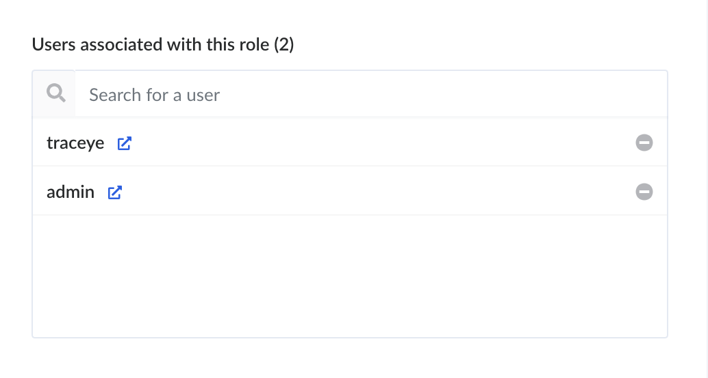

# Admin User Guide
The purpose of this guide is to provide actions avaiable to system administators. A system administrator is defined as someone with all permissions with 

## Contents within this guide:
1. Add new users
1. Change Permissions
1. Manage content types
1. All admin operations

### Add new users
There are several ways to add new users into the system. You can acess the Strapi admin portal and eneter user information (See below) OR you can preform the operations from the dashboard in app.

1. Sign in using Admin credentails and navigate to your dashboard.
1. Click Import Users.

1. Select desired form of import.

1. Enter or upload the requested information.
1. Click either **Add User** or **Import** to create.

### Change permissions
Permissions can be changes from the Strapi to the admin portal. Please sign in with the administrator credentials. After signing in, on the left-hand panel, navigate to Roles and Permissions. 

Add new Role: 
Select add a new role above the existing roles and enter the role information.

#### Change role permissions:
Click on the role you want to change.
Scroll to see the permissions given.
Check or uncheck any permission you want to change.

Click the Save button.

#### Change user roles:
Click on the role you want to add a user to.
Search for the user under "Users associated with this role."
Click the desired user.

Click the green Save button. 

Note: you may want to export the database after changing permissions to ensure that changes are preserved.

### Manage content types
Contnent types can be created, edited, and deleted through the Strapi admin portal. Please sign in with the administrator credentials. After signing in, on the left-hand panel, navigate to Content-Types Builder. 

#### To create:
Select the blue Add new collection type or Add new single type under existing types.

#### To edit:
Select the type you want to edit. Configure the fields as desired by clicking on each field or adding new fields.

#### To delete:
Click on the type to delete. Select the edit icon next to the content type name. Click the red Delete button. 

Note: changing the contnent types may cause errors on the frontend. Content types should be tested before adding them to production.

### All admin operations
Administrators are able to preform actions defined in other user guides. If desired you can explore other guides to gain information about how to prefrom other operations including management of proposals, departments and sponsors. However most operations can be preformed from within the Strapi Admin portal.

#### To view current data:
You can click on the name of any content type located at the top of the left-hand panel. 

Data is organized into pages and the view can be customized by clicking **Configure the view**. 

#### To create a new data:
Click on the desired contnent type to add to under Collection Types.
Click the blue **Add New ...**
Enter the data.

#### To edit existing data:
Click on the desired contnent type to add to under Collection Types.
Click the edit icon next the entry in the table
Enter the data.
Select Save.

#### To delete data:
Click on the desired contnent type to add to under Collection Types.
Click the trash icon next the entry in the table
Confirm that you would like to delete the entry by clicking the blue **Confirm** button.

