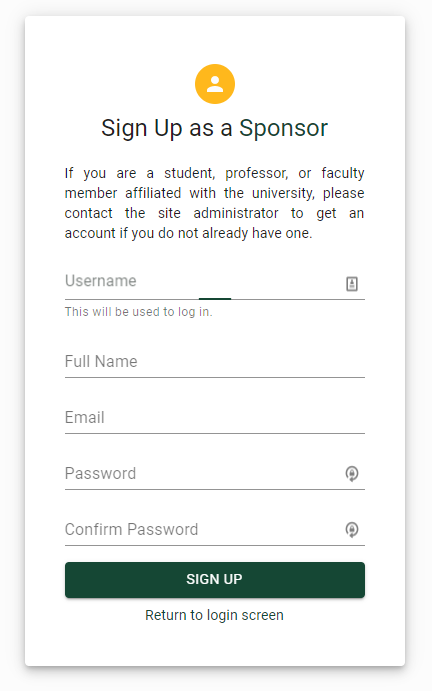
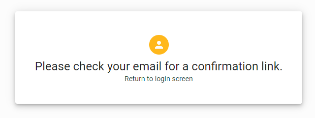

# Authentication and Authorization

Archway has users, and these users can be authenticated and preserved throughout page visits.

## Strapi Authentication

Strapi has a well defined [authentication API](https://strapi.io/documentation/3.0.0-alpha.x/guides/authentication.html) which allows for easy implementation and integration of authentication throughout an application. Installed by default, this API allowed for simple axios calls to be used to push and pull data to/from Strapi. Strapi handles the majority of the user creation/managing, and gives very simple endpoints for accessing/changing data about a user. As you see above, there is a very simple form for the user to fill out to sign up for Archway.

This is an example of an axios call that would be used to register with Strapi. The user does not see this, as it is masked behind the sign-up screen (shown above). 

## JSON Web Tokens (JWTs)

A [JSON Web Token](https://jwt.io/) is an industry standard way of sharing secure data between two parties. This is utilized in Archway in order to login and authenticate oneself through Strapi. Strapi has a well documented way of [using and creating these JWTs.](https://strapi.io/documentation/3.0.0-alpha.x/guides/authentication.html#token-usage) A JWT has a lifetime where it is valid, and after that lifetime concludes, the JWT is no longer able to used to authenticate a user. JWTs are also invalid if the user changes their password or credentials or anything of that sort as well.

Here, you can see that there is a sample JWT that contains basic data about John Doe. This can be decoded and encoded to ensure a secure transfer of data between two parties. 

## Local Storage

Archway stores the JWT within the local storage of the user's browser. This means that once the user logs in once, they need not log in again until their token is invalid (due to time, password change, etc.) or they log out of their browser.

## Email Verification

Upon initial signup, the user is prompted that their account is not fully valid until their email has been verified.

 
The email is sent out using the Strapi [email plugin.](https://strapi.io/documentation/3.0.0-alpha.x/guides/email.html) This allows for no duplicate accounts, nor spam signups that would allow for spam within Archway.

The email the user would receive to confirm their email looks like the following image:

The user is then routed to their profile to flesh out their information further to better integrate them into the Archway CMS system.

## Forgot Password?
A user is able to [submit a Forgot Password request](https://strapi.io/documentation/3.0.0-alpha.x/guides/authentication.html#forgotten-password) from the following form:

 
This will email a [Password Reset link](https://strapi.io/documentation/3.0.0-alpha.x/guides/authentication.html#password-reset) to the user, which will then allow the user to reset their password. This requires that the user has access to the initial signup email in order to reset their password. That email looks like:

The user, once they click on 'Password Reset' will be redirected to the reset password form, which looks like this: 

The Unique Code will be autofilled based on the link contained within the email. This will allow the user to reset their password.

## Role-based Access Control

Archway has a few different roles of users. The primary roles of the application are the Admin user, the Professor user, the Sponsor user, the Student user, and the Anonymous user. The largest difference between these roles is what they are allowed to access. Archway has security measures in place to ensure that certain roles only see their specific information, specifically in the dashboards.

For example for the Admin profile: 

The Admin role has many different abilities allowed to them, as seen on the left. However, not every role has all of this access.

As for a Student role, their dashboard looks like this:

One can easily see that there is a significant lack of access in the Student dashboard.

This Role-based Access Control maintains a high level of security. Each user only has certain access to certain data.