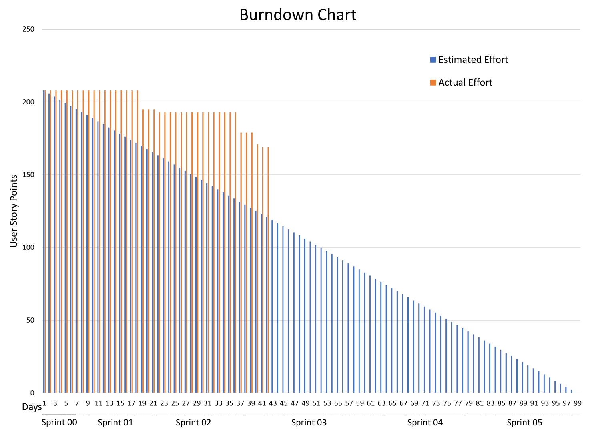
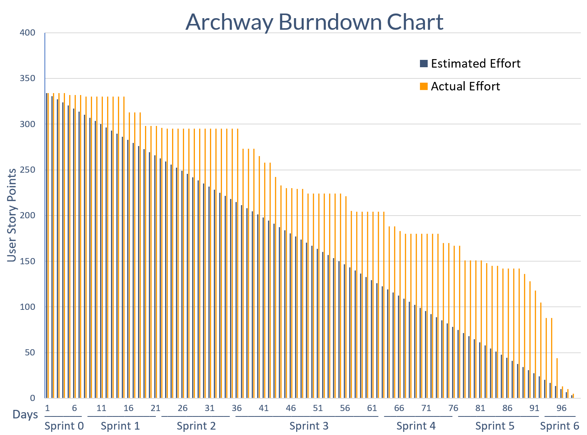

# Burndown Charts

This document shows you the projects burndown charts throughout the two milestones.

## Milestone 1

This burndown chart was made over all issues of [MoSCoW](https://en.wikipedia.org/wiki/MoSCoW_method) priority. We realized after our milestone presentation that this did not do our progress justice as we never considered the 'could' and 'won't' tasks as high priority, so the chart is misleading.

## Milestone 2

This is project's burndown chart at the end of the project after adding more user stories that we failed to add in the beginning. This chart *only* includes must haves and should haves. We successfully completed all of our must haves and should haves in the end although there were some could haves and won't haves left over not shown in this burndown chart.

You can find the associated Excel file used to make these charts [here](files/BurndownChart.xlsx). We used  the Gitlab API to query for issues and Power Query to manipulate the data in preparation for this chart.
