# Database Design Diagram

The following [Mermaid](https://mermaid-js.github.io/mermaid/#/) diagram represents our database schema used for our Strapi content types. This document is intended to reflect the current content type schema within Strapi just in case there is a schema discrepancy.

```mermaid
classDiagram

 class Capstones {
  name : Text
  course: Text
  semester: Text
  preview: Text
  description : Rich text
  isFeatured : Boolean
  isFinishedEditing : Boolean
  startDate : Date
  endDate : Date
  cover : Multiple Media
  media : Multiple Media
  thumbnail : Single Media
  sponsors : Sponsors[]
  members : User[]
  department : Departments
 }

 class Departments {
  name : Text
  url : Text
  email : Email
  phone : Text
  preview : Text
  description : Rich text
  thumbnail : Single Media
  cover : Multiple Media
  capstones : Capstones[]
  proposals : Proposals[]
  professors : User[]
 }

 class Proposals {
  projectTitle : Text
  phone : Text
  email : Email
  isIntellectualPropertyRequired : Boolean
  isNondisclosureRequired : Boolean
  dateSubmitted : Date
  status : Enumeration [notSubmitted,submittedPending,submittedApproved,submittedDenied]
  dateApproved : Date
  projectUse : Rich text
  financialSupport : Rich text
  projectDeliverables : Rich text
  projectDescription : Rich text
  creator : User
  departments : Departments[]
  sponsors : Sponsors[]
 }

 class Sponsors {
  name : Text
  url : Text
  description : Rich text
  isFeatured : Boolean
  isVerified : Boolean
  thumbnail: Single Media
  logo : Single Media
  cover : Multiple Media
  proposals : Proposals[]
  personnel : User[]
  capstones : Capstones[]
 }

 class User {
  username : Text
  Fullname : Text
  jobTitle: Text
  email : Email
  provider : Text
  password : Password
  resetPasswordToken : Text
  confirmed : Boolean
  blocked : Boolean
  role : Role
  description : Rich text
  picture : Single Media
  capstones : Capstones
  department : Departments
  sponsorOrganization : Sponsors
 }

 class Permission {
  type : Text
  controller : Text
  action : Text
  enabled : Boolean
  policy : Text
  role : Role
 }

 class Role {
  name : Text
  description : Text
  type : Text
  permissions : Permission[]
  users : User
 }

 class Faqs {
  category : Text
  question : Text
  answer : Rich text
 }

 class Approval {
  canApprove: Boolean
 }

 class AboutPage {
  main_paragraph : Rich text
 }

 class HeaderFooter {
  headerLinks: JSON
  footerLinks : JSON
 }

 class HomePage {
  infoparagraph : Rich text
  bgimage : Single Media
 }

 class SponsorPage {
  leftcolumn : Rich text
  rightcolumn : Rich text
  bgimage : Single Media
  main_paragraph : Rich text
 }

 class ProposalApproval {
     canApprove: Boolean
 }

 class Theme {
  primaryColor : Text
  secondaryColor : Text
  backgroundColor : Text
  errorColor : Text
  activeColor : Text
  hoverColor : Text
  selectedCover : Text
  universityName : Text
  logo: Single Media
 }


Capstones "1..*" -- "0..*" Sponsors
Capstones "1..*" -- "0..*" User
Capstones "1..*" -- "0..*" Departments

Departments "0..*" -- "1..*" Proposals
Departments "1" -- "0..*" User

Permission "0..*" -- "1" Role

Proposals "1" --> "1" User
Proposals "0..*" -- "0..*" Sponsors

Role "1" -- "0..*" User

Sponsors "1" -- "0..*" User

```

