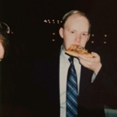
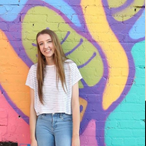

# Group Overview

This document gives an overview of the team/group that built Archway and its members. This information can be used to show the developers behind Archway.

**Group Name**: Pariveda Section 02 Group 03

**Project Name**: Archway

**Team Members**:

| Team Member   | Role    | Picture                       | Description                                                  |
| ------------- | ------- | ----------------------------- | ------------------------------------------------------------ |
| Sean Blonien  | Liaison |    | Sean was the team liaison and project manager for Archway. He facilitated team organization and communication throughout the project and served as the primary point of contact between the team and professors (project stakeholders). Sean implemented a few key features for Archway including Docker files, database import/export scripts, code standardization and linting, RBAC, API controller, auth controller, dashboard page, import users page, markdown components, snackbar notifications, dynamic header and footer, page routing, docker guide, installation guide, and programmer guide. Sean spent a good deal of time assisting and helping out his teammates as well as he was the primary code reviewer with merge requests.    You can learn more about Sean by visiting his [website](https://www.seanblonien.com/) or connecting with him on [LinkedIn](https://www.linkedin.com/in/seanblonien/). |
| Jack Titzman  | Deputy  |    | Jack was the team deputy for Archway. He assisted the team liaison with some merge requests and by meeting with group members individually on a weekly basis. Jack implemented the profile page (view and edit) as well as the search results page. He also spent some time tweaking different parts of the application to ensure it had a high quality look and feel and added lots of sample user data for the final demonstration. Jack also created the team’s vision document.  You can learn more about Jack by connecting with him on [LinkedIn](https://www.linkedin.com/in/jrt0799/). |
| Katy Atchison | Team Member |    | Katy primarily worked on the frontend of the application and was responsible for making the styling of the app configurable in Strapi. She overhauled a lot of the styling to look more modern and uniform throughout. Katy rewrote the Sponsor Landing Page, All Departments Page, Single Department Page, Single Capstone Page, and Single Sponsor Page. She also added filler data for capstones and departments for the final demo.   You can learn more about Katy by connecting with her on [LinkedIn](https://www.linkedin.com/in/katherine-atchison) |
| Caleb Dehaan  | Team Member |   | Caleb was in charge of security on Archway. His primary roles included making sure the authentication and registration worked correctly. He reworked the registration, login, and email verification. In addition to this, he spent time reworking legacy code to better fit the current vision of Archway.    Feel free to find Caleb's contact information on his [website](https://www.calebdehaan.com)! |
| Yunzhe Liu    |         |  |                                                              |
| Emily Tracey  | Team Member |   |Emily focused on ways for users to create and edit data within the app. She developed the new feature to create and approve proposals. In addition, she added management of departments and sponsoring organizations by adding the ability to edit and create. The home page, header, and FAQ page were also redesigned by Emily to improve the look and feel of the site.                                                              |
