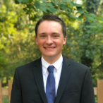

# Group Overview

This document gives an overview of the team/group that built Archway and its members. This information can be used to show the developers behind Archway.

**Group Name**: Pariveda Section 02 Group 03

**Project Name**: Archway

**Team Members**:

| Team Member    | Role     | Picture                           | Description  |
|--------------- |--------- |---------------------------------- |------------- |
| Sean Blonien   | Liaison  |        | Sean was the team liaison and project manager for Archway. He facilitated team organization and communication throughout the project and served as the primary point of contact between the team and professors (project stakeholders). Sean implemented a few key features for Archway including Docker files, database import/export scripts, code standardization and linting, RBAC, API controller, auth controller, dashboard page, import users page, markdown components, snackbar notifications, dynamic header and footer, page routing, docker guide, installation guide, and programmer guide. Sean spent a good deal of time assisting and helping out his teammates as well as he was the primary code reviewer with merge requests.    You can learn more about Sean by visiting his [website](https://www.seanblonien.com/) or connecting with him on [LinkedIn](https://www.linkedin.com/in/seanblonien/). |
| Jack Titzman   | Deputy   |        |              |
| Katy Atchison  |          |        |              |
| Caleb Dehaan   |          |       |              |
| Yunzhe Liu     |          |      |              |
| Emily Tracey   |          |       |              |
