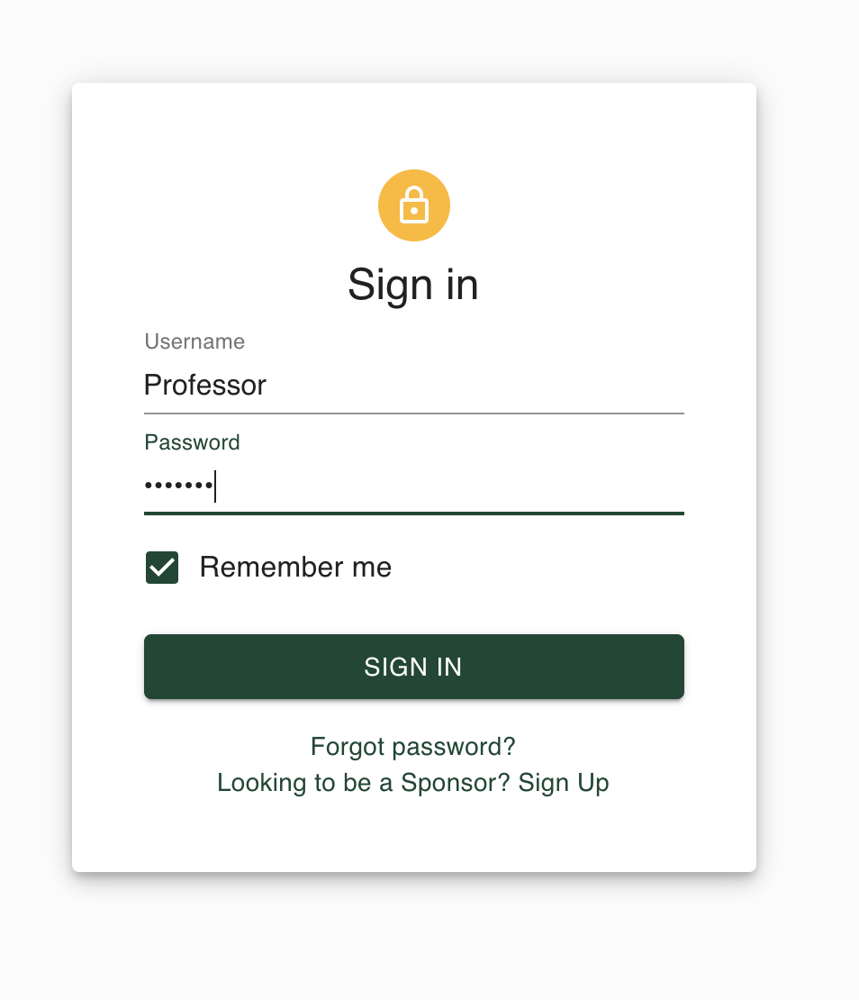
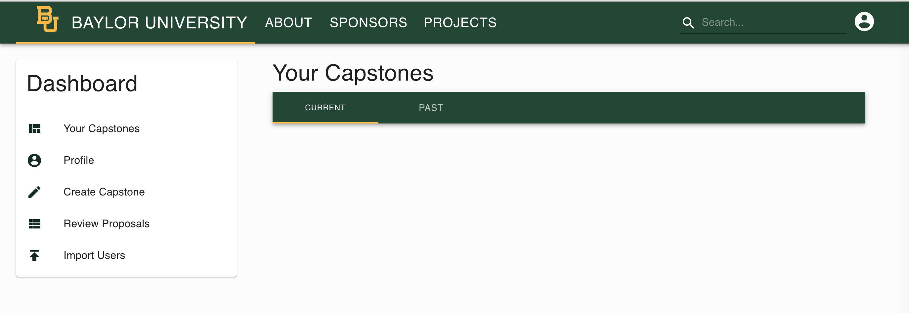
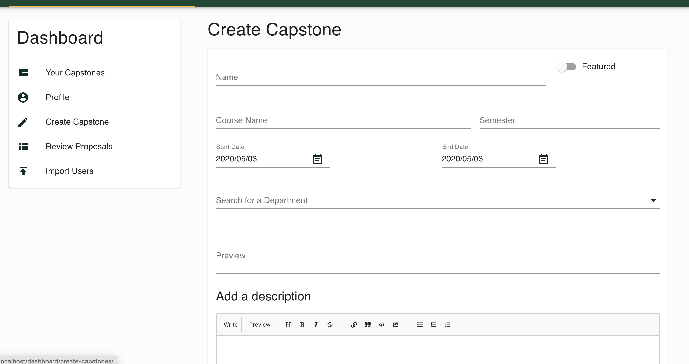
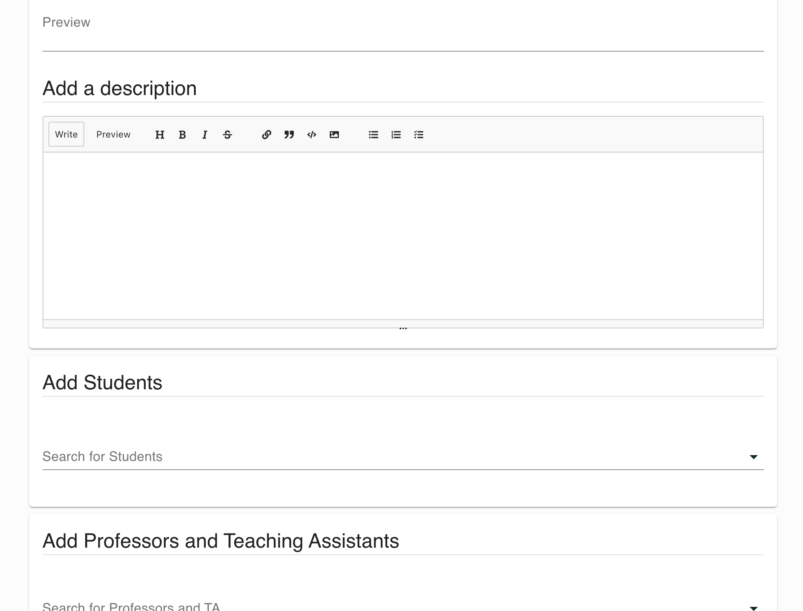
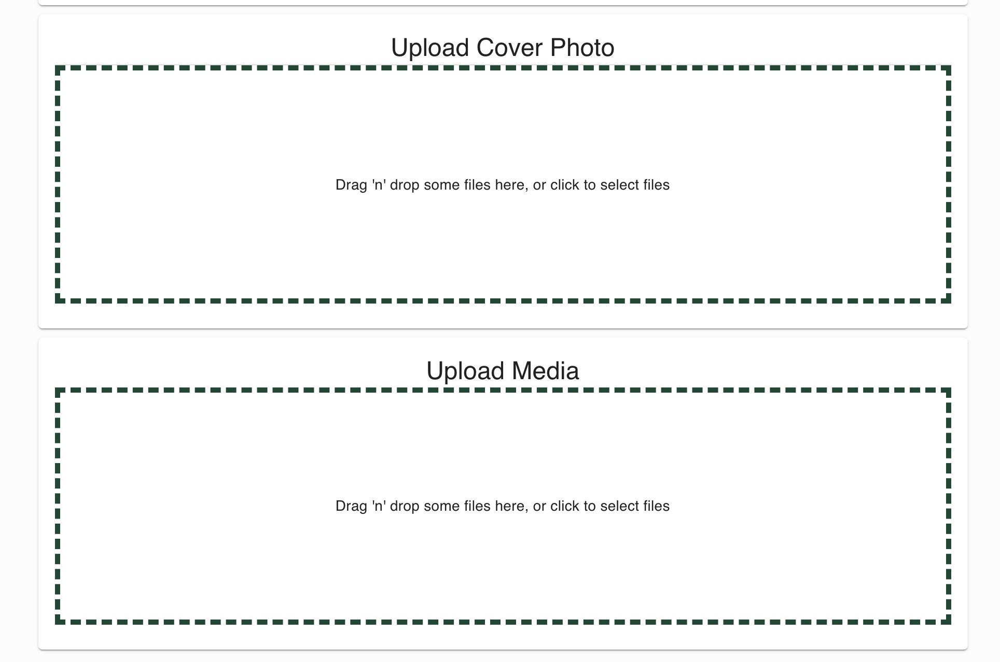
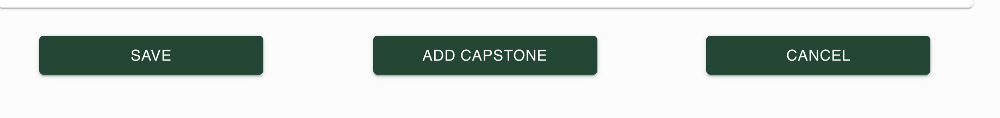
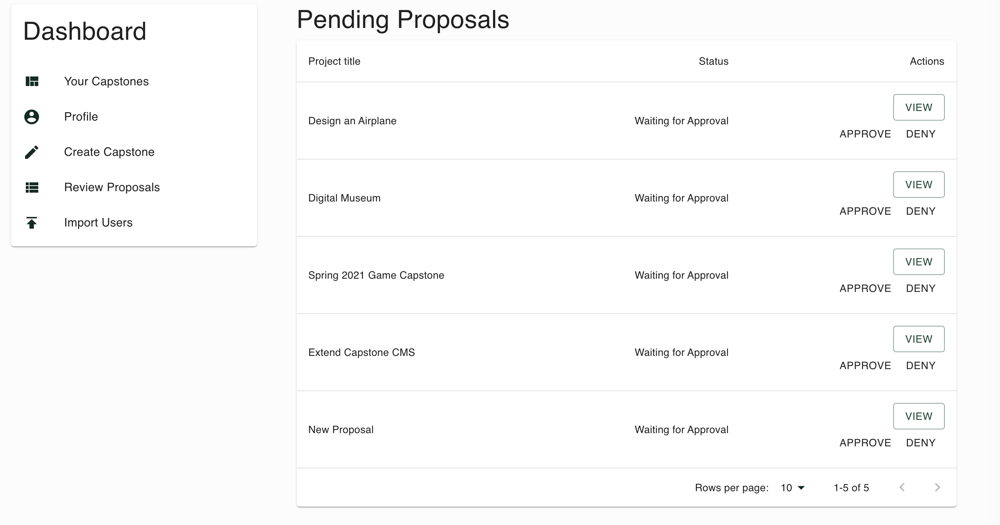
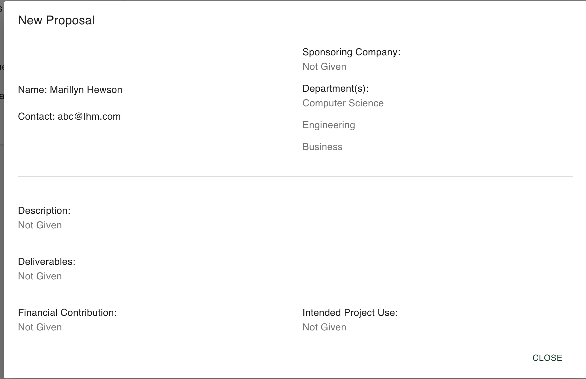
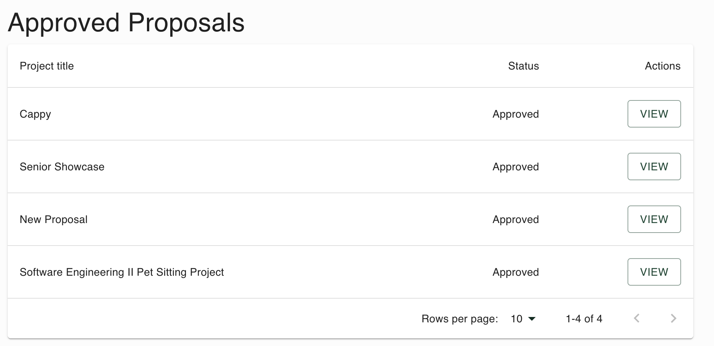
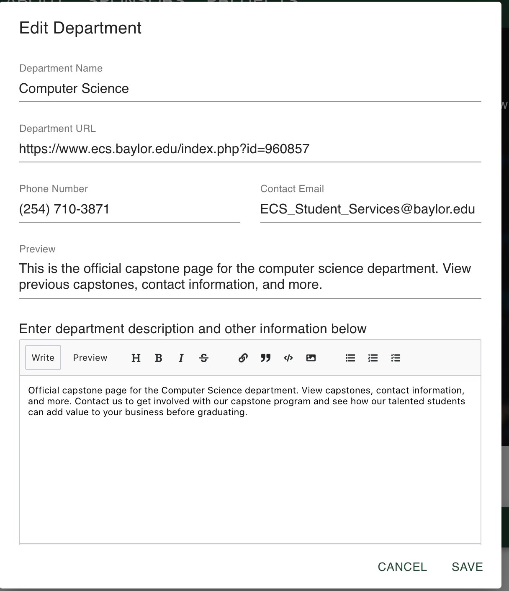

# Professor User Guide

By Yunzhe Liu 

This document shows the professor type of user how to use Archway and its functionality

## Login 

Professor user can login via the login page of Archway by entering their username and password

     

## Dashboard

Professor can go to their dashboard by clicking the icon on the top right corner

After going to the dashboard page, professor can view all the functionalities of dashboard it includes:  
* view capstones related to the professor
* view professor profile
* create a capstone
* review proposals
* import users

## Create Capstone

Professor user can go to create a capstone via the dashboard page, professor can enter relevent information in the text field, choose a date from the date picker, use autocomplete functionality to search for members, deparment and sponsors. Professor can upload a thumbnail, multiple cover photo and media images via drag and drop or uploader.

Professor can click on "save" to save unfinished work, click on "add capstone" to check for required field and submit capstone. "cancel" to remove changes

After submitting the capstone, professor will be directed to the detailed page of the new capstone, the professor can click on "edit captone" to edit the capstone and save new changes using the same forms

## Proposal

Professor user can go to the "Review Proposals" section on the dashboard to review the proposals from other users.

Professor can view the detailed information about the proposals and choose to approve or deny action  
After approval the professor can view the passed proposals

## Edit Department

Professor user can go to the department page and choose to edit the department information  
After going to the department page, the professor can click on the "edit department" button to begin editing department

After clicking on the button, the professor can edit the information of the department and save the changes

