## Public User Guide

The purpose of this guide is to provide instructions on operations available to all unauthenticated users. This includes any person viewing the site who has not created or logged in to an account. This is the base level of functionality that all users, authenticated or not, will have on this application.

### Contents within this guide:

1. Getting more information
2. Viewing sponsors
3. Viewing departments
4. Viewing capstones
5. Viewing profiles
6. Searching for capstones

#### 1. Getting More Information

Upon being routed to our site, you will start off on our home page. Here you can learn more about Baylor University, see some of our featured capstones, and see some of our featured sponsors (clicking on either of these will take you to their corresponding pages). The navbar and the footer both contain links for navigating around our site. Clicking on *Baylor University|Archway* at any time will take you back to this home page.

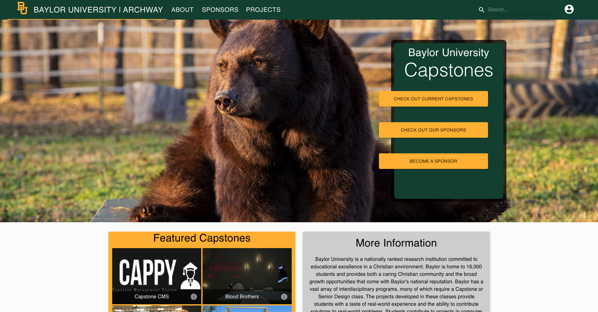

If you hover your mouse over the link in the navbar titled *About*, you will be presented with two options. Clicking on *About Us* will take you to a page where you can scroll through and learn more information about Baylor, our software, and the history of our application, including how we selected its name. 

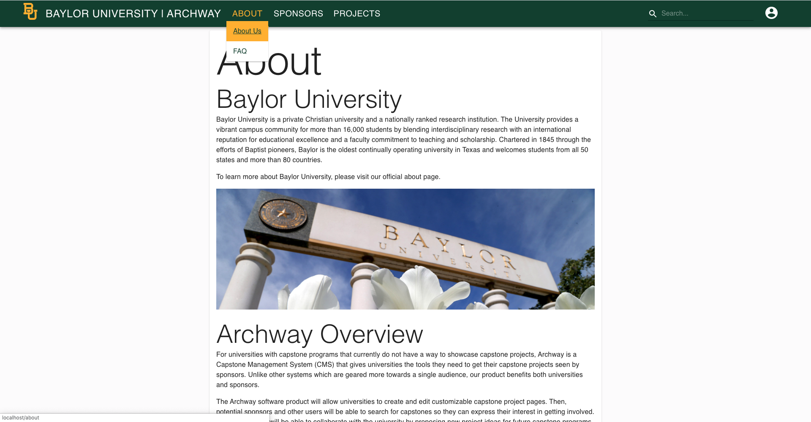

Clicking on *FAQ* will take you to our Frequently Asked Questions page. Here you can scroll through some common questions about us, our site, Baylor, becoming a sponsor at Baylor, and what to do if you cannot access your account. Clicking on any of these questions at the top of the page will automatically scroll the page down to where this question is answered.

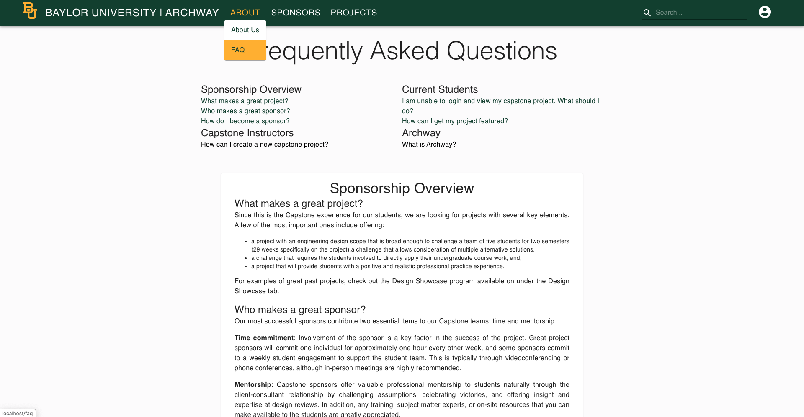

If you hover over *Sponsors* in the navbar and select *About Sponsors*, you will be taken to a page where you can view some information about sponsorship at Baylor, including benefits to students, benefits to sponsors, the kind of projects we are looking for, and how to become a sponsor.

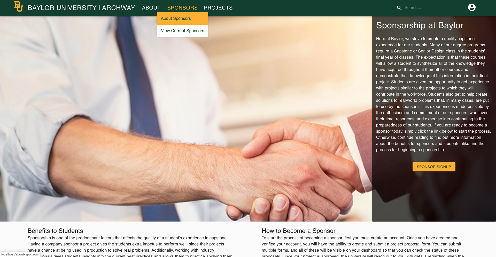

#### Viewing Sponsors

To get to our listing of current and past sponsors, hover over *Sponsors* in the navbar and select *View Current Sponsors*. Here you will see all companies that have sponsored Baylor capstone projects in the past or are currently involved in projects, along with their brand and a short preview about the company. 

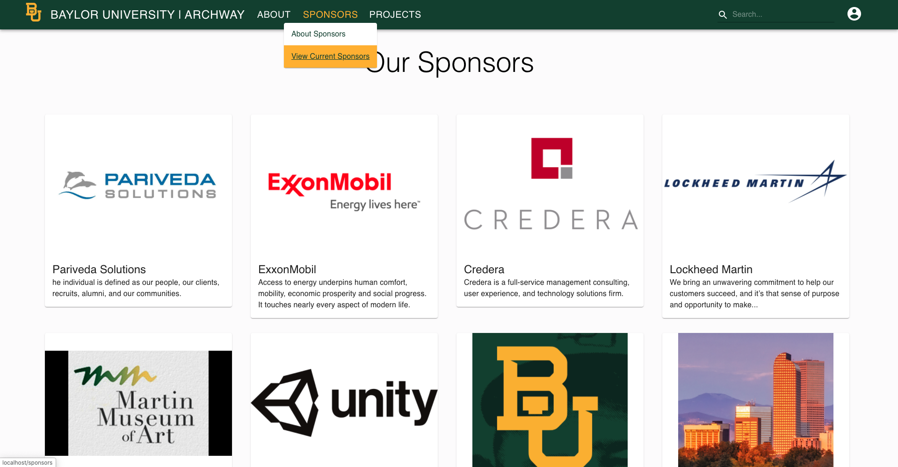

Clicking on any of these icons will take you to that company's personalized page. 

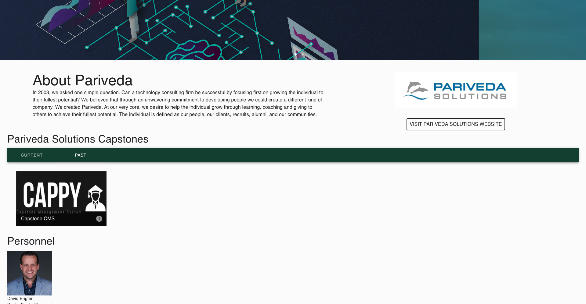

This page will provide more information about the company, show a list of company employees that have an account on Archway, and provide a link to their site. Clicking on any person's avatar will take you to their profile page. Clicking on a capstone will take you to that capstone's personalized page. Clicking the link will take you to that company's website. 

#### Viewing Capstones

To get to the listing of Capstones, hover over *Projects* in the navbar and select *All Capstones*. Here you will see all of the capstones that have occurred in the past or currently, from all departments. 

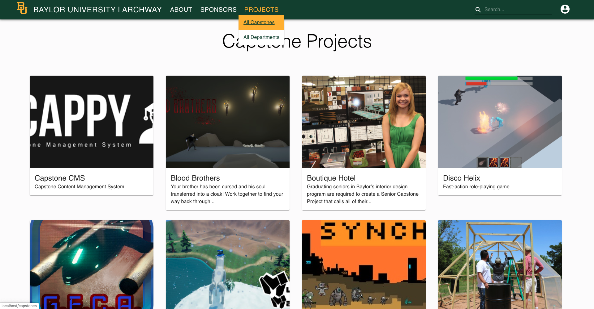

Clicking on any of these icons will take you to that capstone's personalized page. 

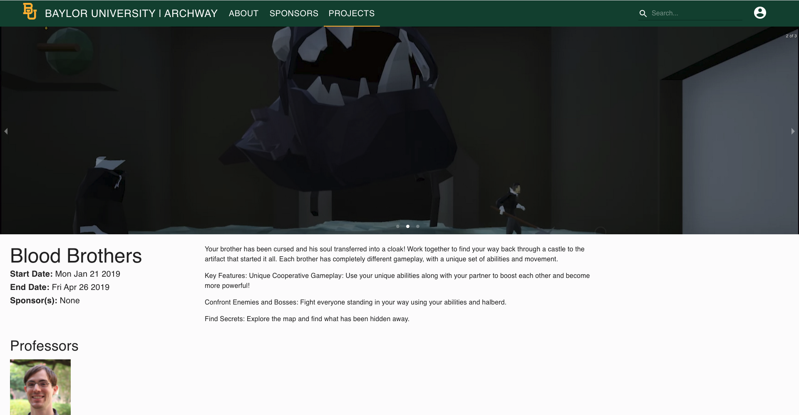

This page will provide more information about the capstone's problem statement, show the company that sponsored the project, and show the avatars of all students and faculty involved in the project. Clicking on any of these avatars will take you to that person's profile page. 

There is also a photo gallery at the bottom of the page.

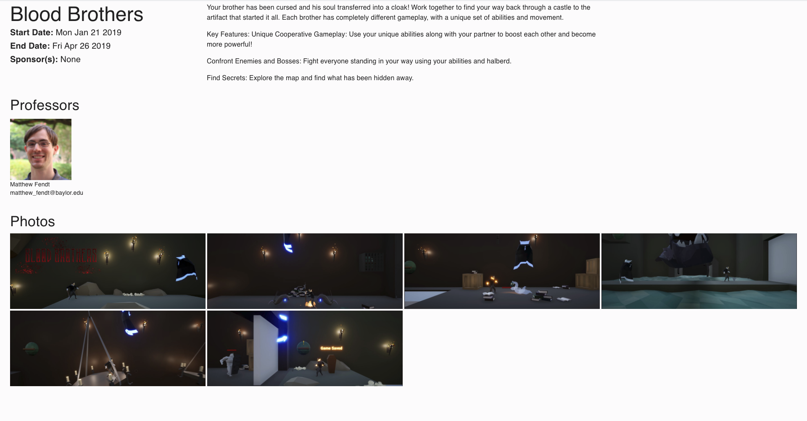

Clicking on a photo will make that photo fullscreen. In fullscreen mode, you can use the side arrows to flip through all pictures in the photo gallery. 

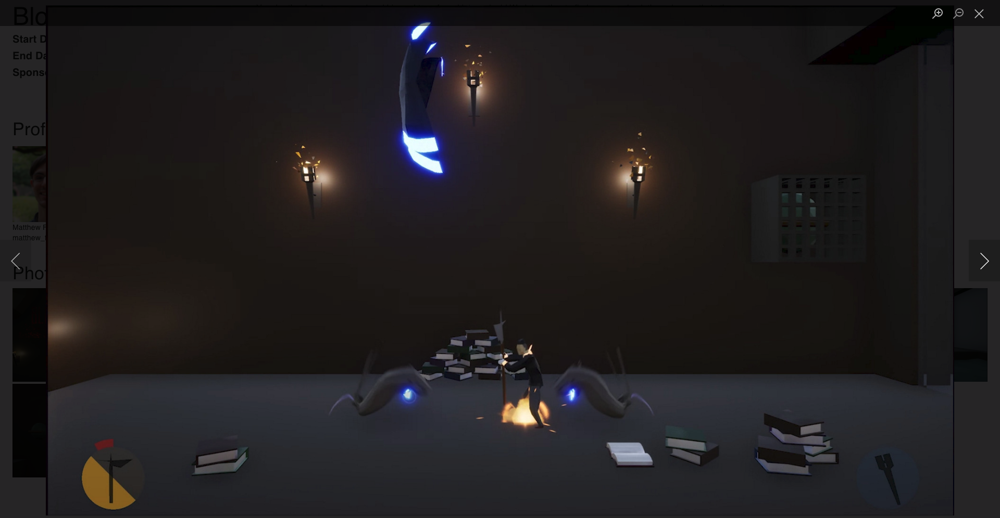

#### Viewing Departments

To get to the listing of Departments, hover over *Projects* in the navbar and select *All Departments*. Here you will see all of the Baylor departments that have capstone or senior design projects. 

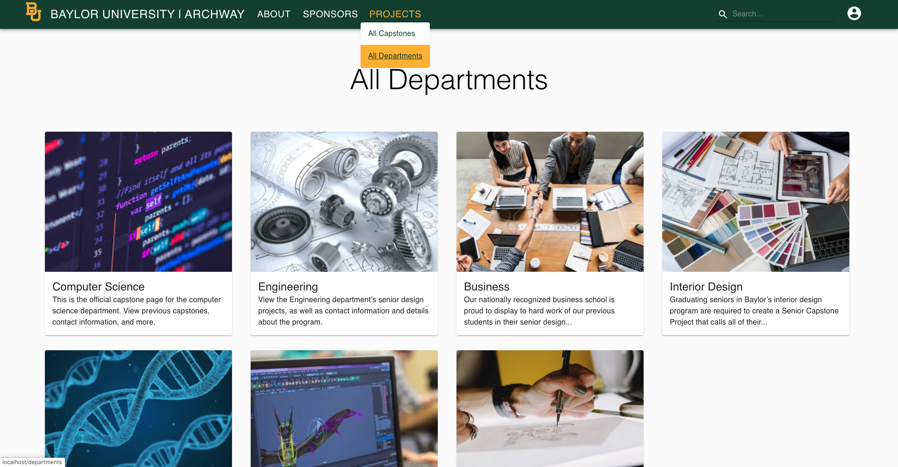

Clicking on any of these icons will take you to that Department's personalized page. 

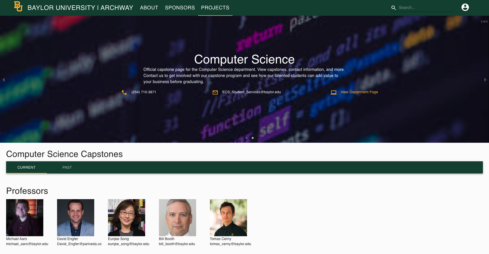

This page will provide more information about the Department, provide contact info for the department, show a listing of current capstone projects and past capstone projects, and show a list of all professors that have a profile on Archway. Clicking on a capstone will take you to that capstone's personalized page. Clicking on a professor's avatar will take you to their profile page. Clicking on any of the contact links will allow you to call or email the department or visit their official page.

#### Viewing Profiles

While you cannot currently search for a person's profile, you can click on a person's avatar from a capstone page, department page, or sponsor page and then arrive at their profile page. Here you can find more information about the person as well as a means to contact them. Some people may even list some of their past projects or achievements.

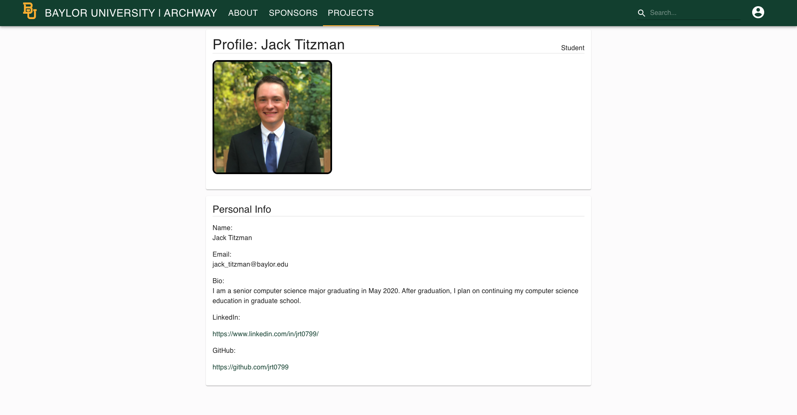

#### Searching for Capstones

To search for capstones, click on the Search Bar in the navbar of the application, enter the name of a capstone, and press Enter. You will be redirected to a search results page, where all capstones matching the name you entered will appear. 

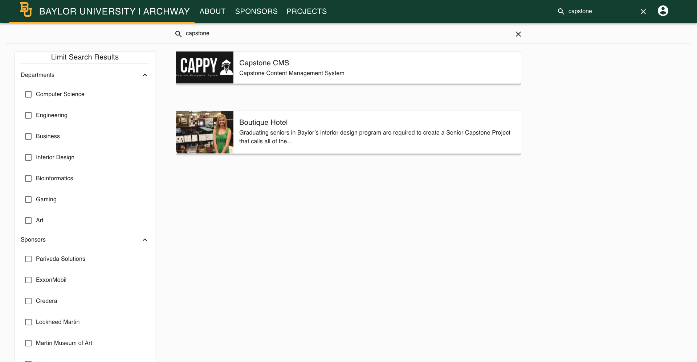

You can filter your search using the filtering options on the left side of the screen. You can filter based on Department and/or Sponsor. Clicking on any of the search results will take you to that capstone's personalized page.

