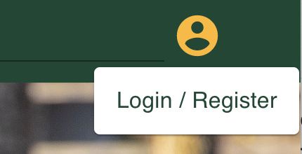
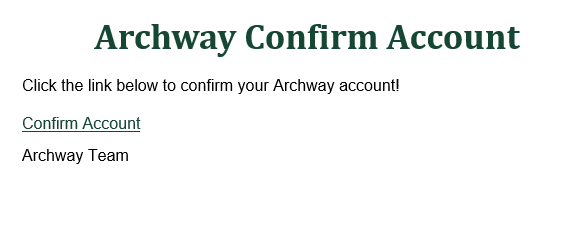
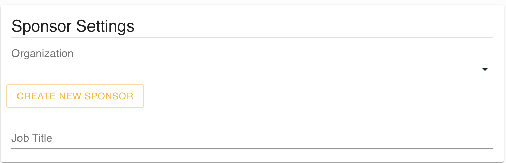
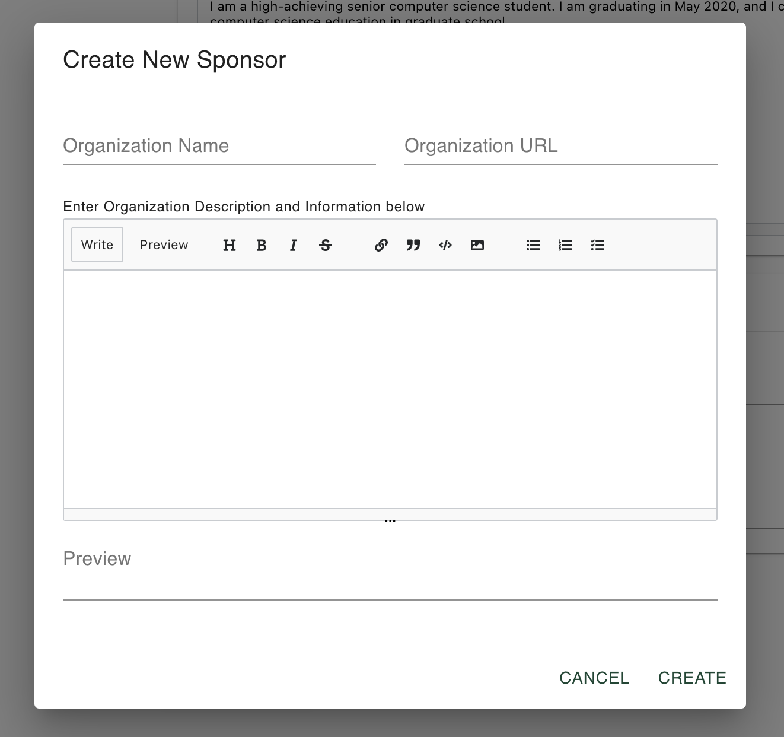
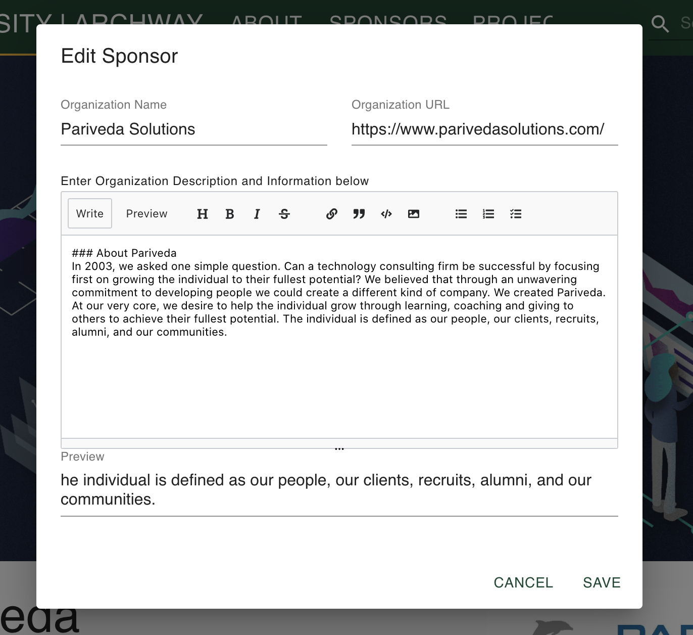
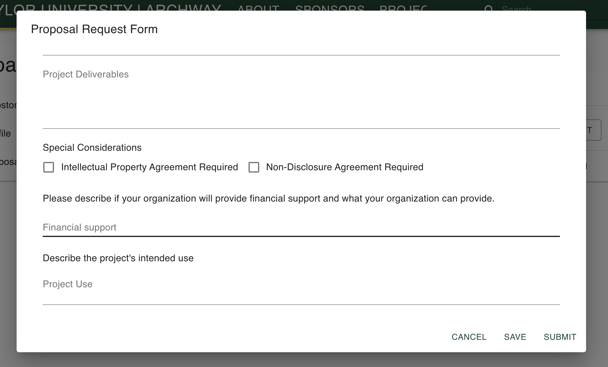
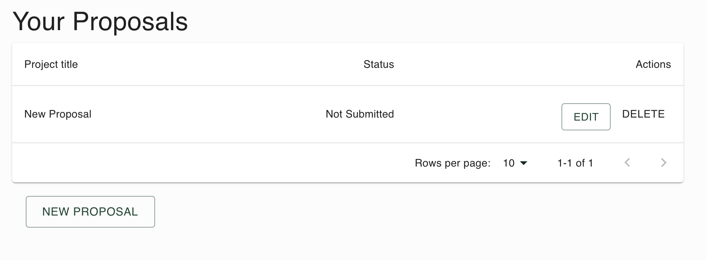

# Sponsor User Guide

The purpose of this guide is to provide operations available to potential and current sponsors. A sponsor is defined as someone who represents a company or organization and is or is looking to provide resources to a capstone project at a university.

## Contents within this guide

1. Getting more information
1. Sign Up/Sign In
1. Adding personal information
1. Add your sponsoring organization
1. Manage your organization
1. Create and manage proposals

### 1. Getting more information

In the base project, you can find information about sponsoring a project by either selecting **Become A Sponsor** from the home page or finding **Sponsors**->**About Sponsors** from the header. Please confirm with your university about how together more information because layouts may change by university. This page is controlled information and may contain requirements, deadlines, and more about becoming a sponsor.

### 2. Sign Up/Sign In

Only sponsors can create their own account. Here is how you can set up yours:

1. Navigate to the register page. It is found by clicking the person logo at the top-right of the page
   
1. Enter valid email, full name, desired username, and password. Please note that usernames must be unique.
   
1. Validate your account.
   

An email should be sent to the address provided. You simply have to click or copy the address contained in the email.

You should now be redirected to your dashboard and profile. You are now authorized to edit information and submit proposals.

If you already have an account navigate to the Sign In page and enter the username and password you registered with. If you forgot your password, click the on screen prompt to see it.

### 3. Adding Personal information

By clicking **My Profile** from your dashboard, you are able to edit all personal information. Click **Edit Profile** to begin editing. You can change your name, email, profile image, and bio. The bio editor allows for Markdown and you are free to format your information however. At the bottom of your profile you can edit information relating to your company/organization and job title. You are free to select your sponsoring organization from the drop down list or add a new one.

Click **Update Profile** to save changes.

### 4. Add your sponsoring organization

1. Click **Add New Organization** from your edit profile. (Seen above)
1. A dialog will open on the screen where you can enter any relevant information.
   
1. Click **Save** when finished.
1. In order to make this your Sponsoring organization please select it from the dropdown on your profile.

Please note that your organization will not be published to the public site until an Admin at the university has verified it.

### 5. Manage your organization

You are only able to manage your organization if it has been verified and you are a personnel of that company.

1. Ensure that you are signed in.
1. Navigate to your sponsoring organization's page.
1. Click the **Edit Sponsor** button located on the cover photo.
   
1. A dialog will open. Please enter any updated information or upload new photos.
   
1. Click Save.

### 6. Create and manage proposals

To see proposals, navigate to My Proposals from your dashboard.

To create a proposal -

1. Click **New Proposal**
1. Fill out the form.
   
1. If you need to save your progress at any point, click **Save**. This will not submit what you have entered for review.
1. To submit project for review, click **Submit**.

To edit a proposal -
All proposals that are able to edited appear in a table approve the New Proposal button.

Select **Edit** next to the proposal you want to change. Click **Save** or **Submit** when finished.

Select **Delete** to remove a proposal from being reviewed.
