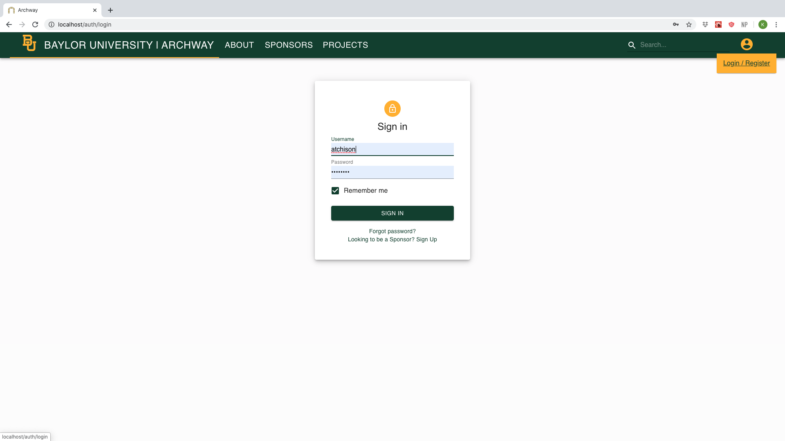
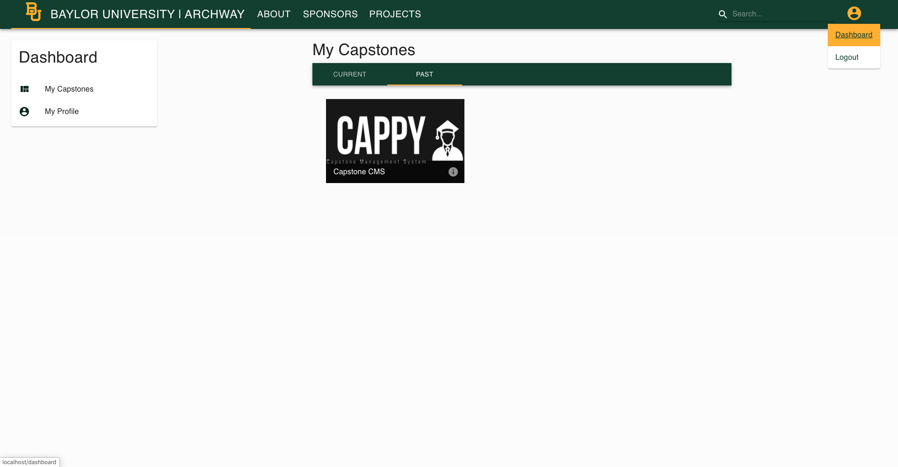
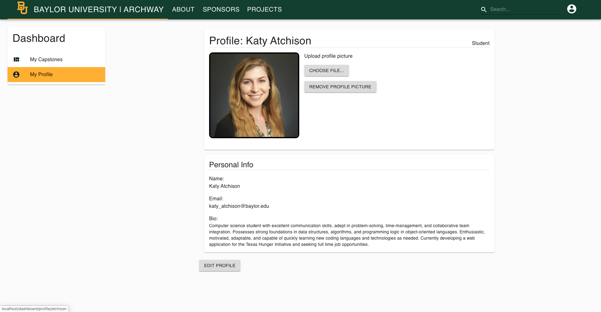
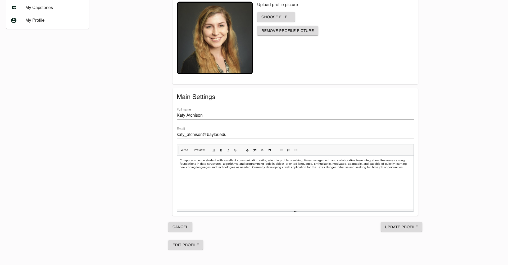

# Student User Guide

The purpose of this guide is to provide instructions on operations available to all students with an account on Archway. A Student is defined as a student currently enrolled at Baylor University who has been given an account on Archway by system administrators and is part of a Capstone or Senior Design class or project.

## Contents within this guide:

1. Logging in
2. Dashboard
4. Editing your profile
   1. Profile picture
   2. Personal info

#### 1. Logging In

In the navbar, the top right corner will contain a User icon. If you hover over this, you will have the option to *Login/Register*. Click on this option, and you will be redirected to the *Login* page.

Your login information will come from the system administrator at your university. Enter your username and password here.

#### 2. Dashboard

After logging in successfully, you will have access to your Dashboard. Click on the User icon in the top right corner, and select *Dashboard* to view it. You have two options to view on your dashboard: *My Capstones* and *My Profile*. By default, you will start on *My Capstones*. Here, you will be able to see all capstones you are associated with, both from the past ahd currently. Clicking on any of these capstones will take you to the personalized page for this capstone.

#### 3. Editing Your Profile

On the left side of your dashboard, you will see links to *My Capstones* and *My Profile* that will allow you to toggle between the different parts of your dashboard. Select *My Profile* to go to your profile page.

Here you have the options to edit both your profile picture and your personal information.

###### 3.1. Editing profile picture

To upload a new profile photo, click on the "Choose File" button. You will then be able to select a file from  your computer. After the file is selected, click the "Upload File" button, and this photo will now be your profile photo! To remove the picture, just click "Remove Profile Picture".

###### 3.2. Editing personal info

To edit your personal information, click on the "Edit Profile" button underneath your bio. A Markdown editor will appear, where you can edit your bio, add more links, and even add images using standard Markdown. 

When you have finished editing your personal information, click the "Update Profile" button for the changes to be saved. To undo any changes you have made, click on the "Cancel" button.