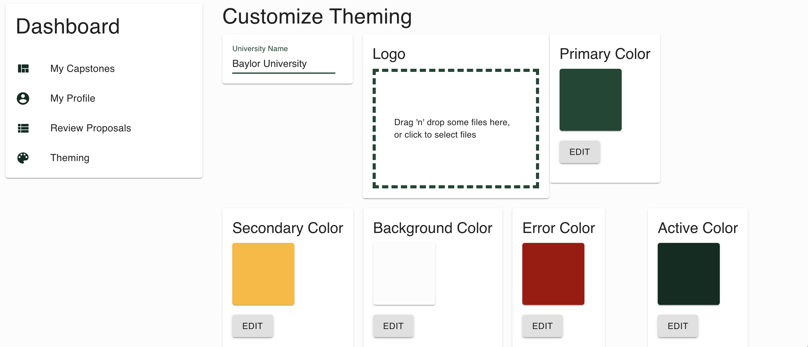
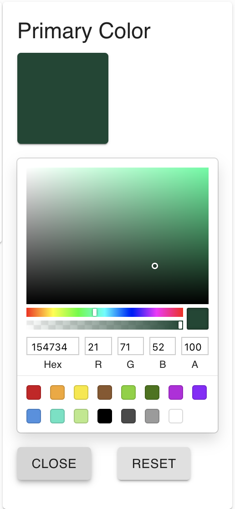
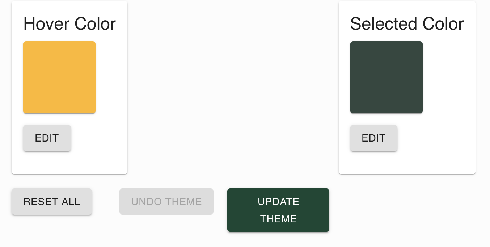
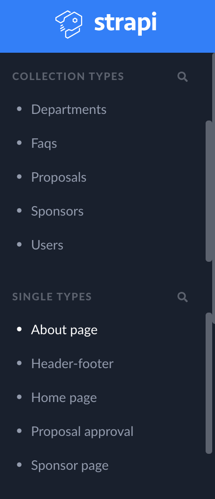
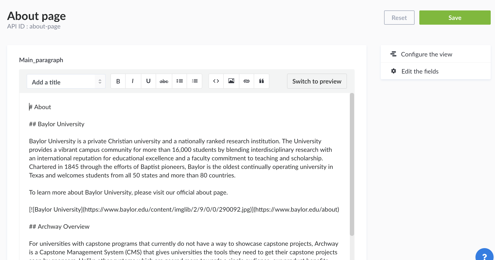

# University Marketing User Guide

The purpose of this guide is to provide operations available to university marketers. A University Marketer is defined as someone who wishes to change page content, images and colors.

## Contents within this guide

1. Access your account
1. Change the theme
1. Change page content

### 1. Access your account

You should have been provided with a username and password from the administrator of the system. If you are unsure about your credential please reach out to the administrator. After confirming your username and password, you can sign into the application using the standard sign in page.

### 2. Change the theme

1. Sign into the Archway application.
1. Navigate to your dashboard and select **Theming**
   
1. Use the color selector to either enter your desired hex value, RGB value or drag to find a new one.
   
1. At the bottom of the page select Update Theme to save your changes, or Undo Theme to revert back to original colors.
   

### 3. Change page content

If desired, university marketers may be given access to the Stapi admin portal to change page content. This includes uploading new images and changing text on pages like the home page, about page, ect. In order to make these changes you will need Strapi administrator privileges, so check with system admins to gain access if you need to make these changes.

1. Find and Click on your desired page to edit under the Single Types in the left-hand Strapi admin window.
   
1. Type any changes or upload desired images.
1. Click the green Save button on the top right when finished.
   
