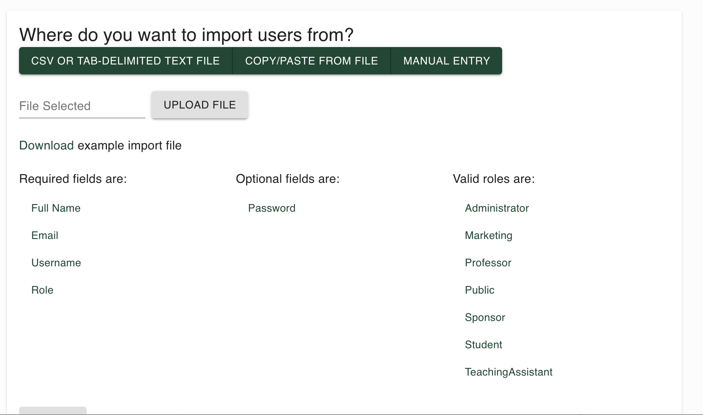
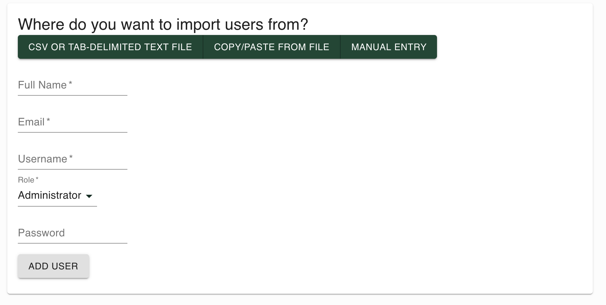
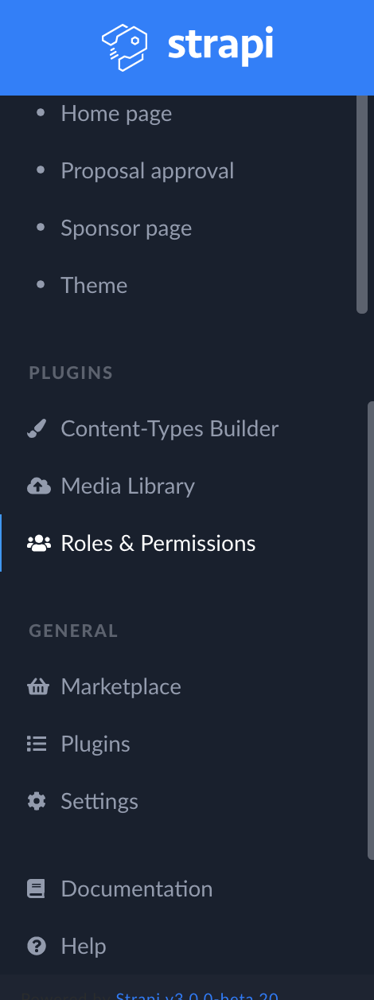
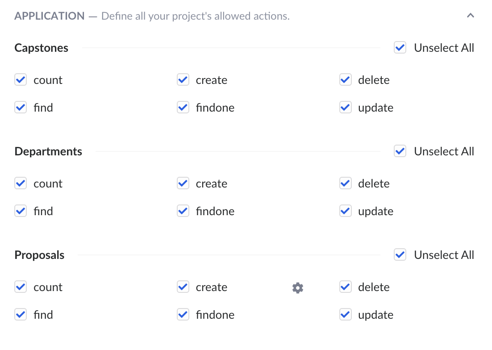
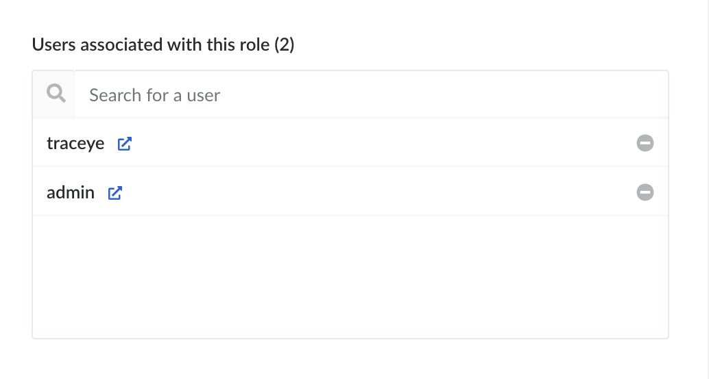
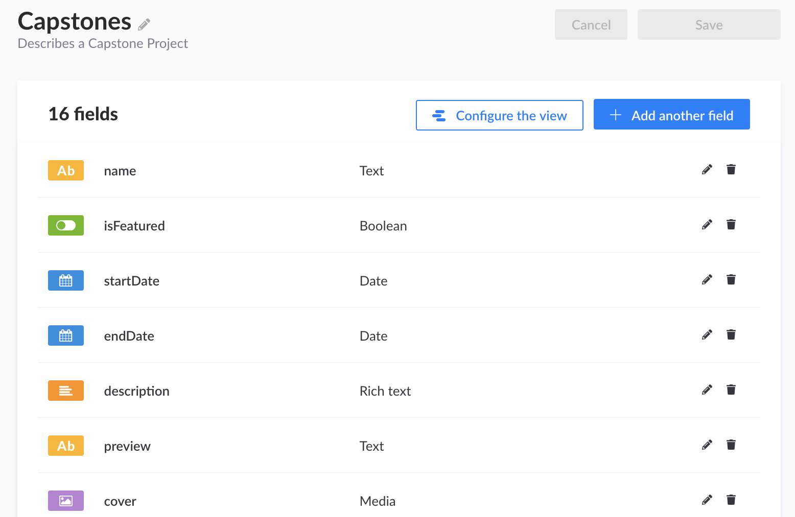
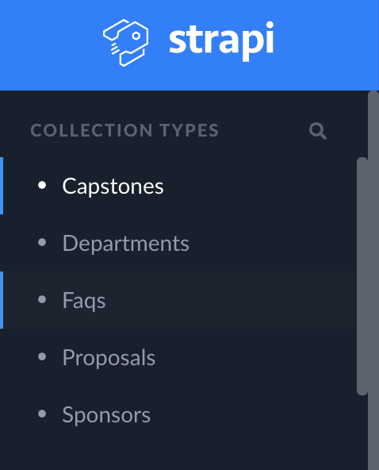

# Admin User Guide

The purpose of this guide is to provide actions available to system administrators. A system administrator is defined as someone with all permissions with

## Contents within this guide

1. Add new users
1. Change Permissions
1. Manage content types
1. All admin operations

### 1. Add new users

There are several ways to add new users into the system. You can access the Strapi admin portal and enter user information (See below) OR you can preform the operations from the dashboard in app.

1. Sign in using Admin credentials and navigate to your dashboard.
1. Click Import Users.
   
1. Select desired form of import.
   
   
1. Enter or upload the requested information.
1. Click either **Add User** or **Import** to create.

### 2. Change permissions

Permissions can be changes from the Strapi to the admin portal. Please sign in with the administrator credentials. After signing in, on the left-hand panel, navigate to Roles and Permissions.

Add new Role:
Select add a new role above the existing roles and enter the role information.

#### Change role permissions

Click on the role you want to change.
Scroll to see the permissions given.
Check or uncheck any permission you want to change.

Click the Save button.

#### Change user roles

Click on the role you want to add a user to.
Search for the user under "Users associated with this role."
Click the desired user.

Click the green Save button.

Note: you may want to export the database after changing permissions to ensure that changes are preserved.

### 3. Manage content types

Content types can be created, edited, and deleted through the Strapi admin portal. Please sign in with the administrator credentials. After signing in, on the left-hand panel, navigate to Content-Types Builder.

#### To create

Select the blue Add new collection type or Add new single type under existing types.

#### To edit

Select the type you want to edit. Configure the fields as desired by clicking on each field or adding new fields.

#### To delete

Click on the type to delete. Select the edit icon next to the content type name. Click the red Delete button.

Note: changing the content types may cause errors on the frontend. Content types should be tested before adding them to production.

### 4. All admin operations

Administrators are able to preform actions defined in other user guides. If desired you can explore other guides to gain information about how to perform other operations including management of proposals, departments and sponsors. However most operations can be preformed from within the Strapi Admin portal.

#### To view current data

You can click on the name of any content type located at the top of the left-hand panel.

Data is organized into pages and the view can be customized by clicking **Configure the view**.

#### To create a new data

Click on the desired content type to add to under Collection Types.
Click the blue **Add New ...**
Enter the data.

#### To edit existing data

Click on the desired content type to add to under Collection Types.
Click the edit icon next the entry in the table
Enter the data.
Select Save.

#### To delete data

Click on the desired content type to add to under Collection Types.
Click the trash icon next the entry in the table
Confirm that you would like to delete the entry by clicking the blue **Confirm** button.

